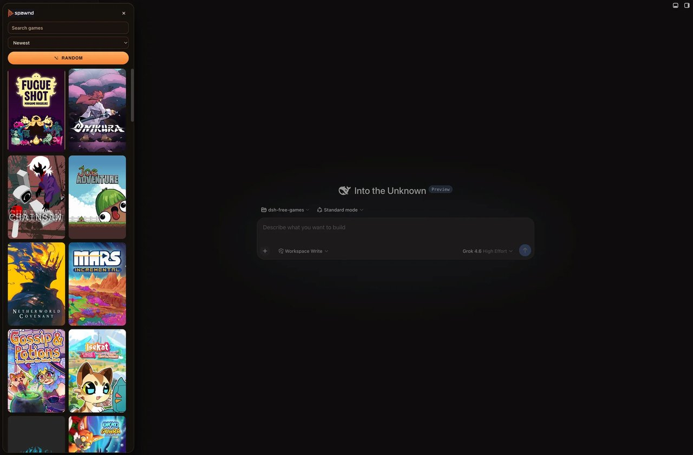
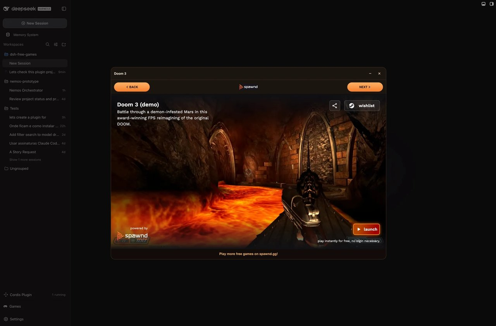
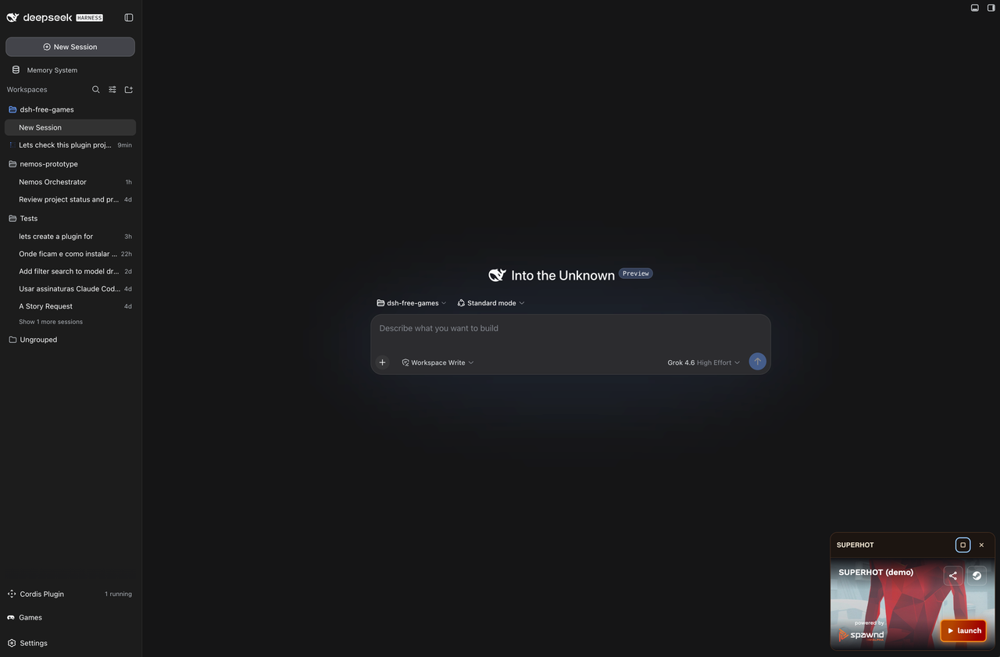

# dsh-free-games

A [DeepSeek Harness](https://github.com/deepseek-ai/deepseek-harness) Web plugin that adds a **Games** button above Settings.

All games come from **[Spawnd.gg](https://www.spawnd.gg/)**, a free premium games website. This plugin does not load catalogs, covers, clips, or embeds from any other source.

This is an independent community plugin. It is **not** an official DeepSeek or Spawnd product.

## Screenshots







## Install

```sh
dsh plugin --profile web add github:Entaum/dsh-free-games
```

Pin a commit for production:

```sh
dsh plugin --profile web add github:Entaum/dsh-free-games#<40-character-commit>
```

From this checkout (development link — keep the directory in place):

```sh
dsh plugin --profile web add ./
```

Restart `dsh web`, then refresh the GUI.

## Activate / verify

After install, `dsh --profile web --dump-config` should list `dsh-free-games` as a bundle layer. The Web GUI should show **Games** in the sidebar footer above Settings.

## Disable / uninstall

```sh
dsh plugin --profile web remove dsh-free-games
```

Then restart `dsh web`. There is no extra config file. Recently played IDs live only in the browser (`localStorage` key `dsh-free-games:recent`).

## What it does

- Sidebar **Games** control in `sidebar.footer.action` (order 80, above Settings), matching Settings chrome.
- Cabinet grid of **published** games from `data/spawnd_game_list.json` only.
- Live Spawnd data fills **covers and hover clips** only; it does not add extra games. Host recaches that overlay about every 15 minutes.
- Search by name. Sort: **Newest** (default, `published_at`), **Name**, **Recently played**.
- Click a cover to open the 16:9 embed. Minimize keeps the iframe mounted. On narrow screens, minimize hides the player; Games restores it.
- Back / Next around a clickable Spawnd logo. Next picks a random other published game.
- Outbound Spawnd links use `utm_source=deepseekplugin` and `rel="noopener noreferrer"`.

## Spawnd.gg only

The plugin refuses any non-Spawnd URL:

- Page and embed URLs must be `https://www.spawnd.gg/` or `https://spawnd.gg/`
- Cover and clip URLs must be `https://assets.spawnd.gg/`
- Host fetches only `https://www.spawnd.gg/en/__data.json` and `https://www.spawnd.gg/en` (no redirects)
- Games without a valid Spawnd embed are dropped
- The Client will not iframe or media-load any other host

Game iframes still run third-party Spawnd code.

## Compatibility

Tested against DeepSeek Harness Web (`dsh web`) around `0.1.0-rc` / `0.1.1-rc.2` with `@deepseek-ai/cordis` `^4.0.1`. Requires the web profile (Host `webServer` + Client slots).

Check the bundle contract locally:

```sh
node scripts/check.mjs
```

## Marketplace submit

1. This package lives at the root of the public repository [Entaum/dsh-free-games](https://github.com/Entaum/dsh-free-games).
2. Add the GitHub topic **`dsh-plugin`**.
3. Open the bilingual submit page at [dsh.pub/en/submit](https://dsh.pub/en/submit/) and paste `https://github.com/Entaum/dsh-free-games`.

Do not publish under the reserved `@deepseek-ai` npm scope. Listing is not a security audit or official endorsement. Review [develop-plugin.md](https://dsh.pub/develop-plugin.md) before changing packaging.

## License

MIT. Game names, covers, clips, and embeds belong to their respective authors and [Spawnd.gg](https://www.spawnd.gg/).
